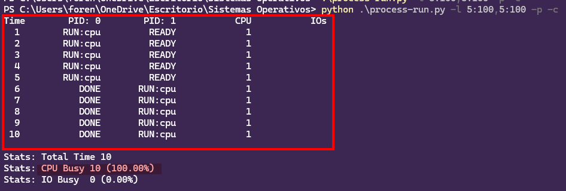
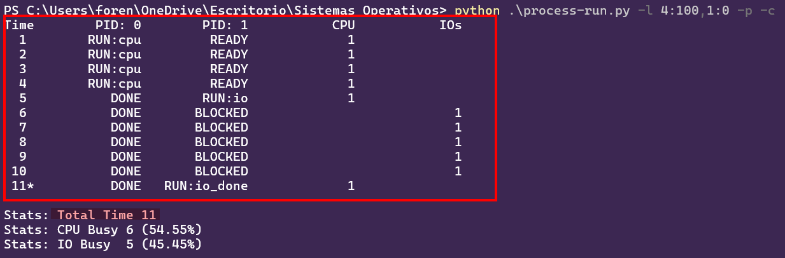
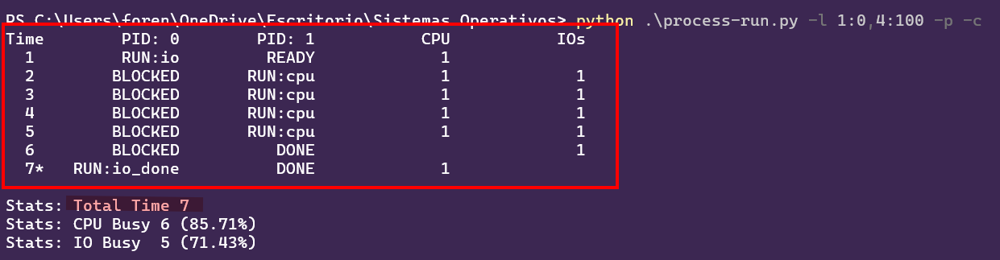
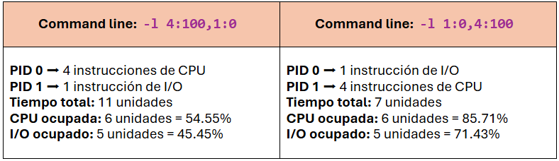
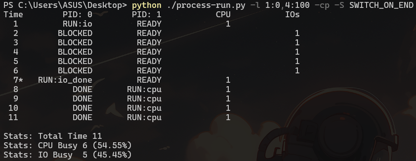
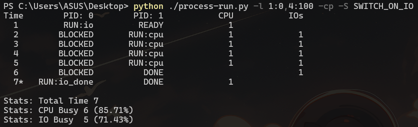
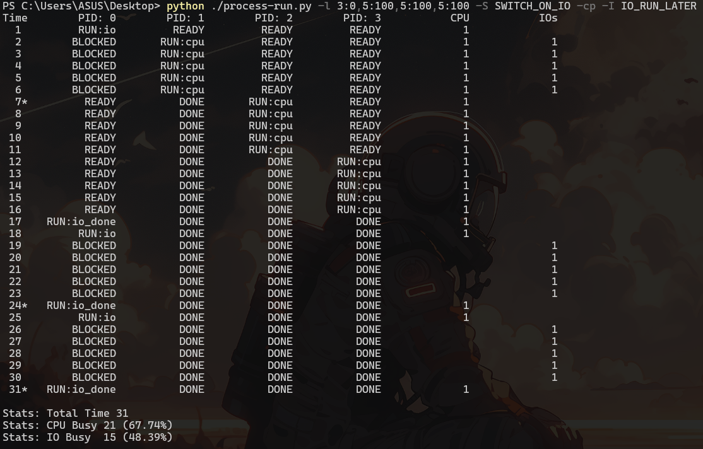

# Actividad de seguimiento - Simulación 1

|Integrante|correo|usuario github|
|---|---|---|
|Valentina Muñoz Rincón|valentina.munozr1@udea.edu.co|ValenMR|
|Juan Felipe Escobar Rendón|juan.escobar15@udea.edu.co|juanfes517|

## Instrucciones

Antes de empezar a realizar esta actividad haga un **fork** de este repositorio y sobre este trabaje en la solución de las preguntas planteadas en la actividad de simulación. Las respuestas deben ser respondidas en español o si lo prefiere en ingles en el lugar señalado para ello (La palabra **answer** muestra donde).

**Importante**:
* Como la actividad es en las parejas del laboratorio, solo uno de los integrantes tiene que hacer el fork; y sobre repositorio bifurcado que se genera, la modificación se realiza en equipo.
* Como la entrega se debe hacer modificando el archivo READNE, se recomienda que consulte mas sobre el lenguaje **Markdown**. En el repo adjuntan dos cheatsheet ([cheat sheet 1](Markdown_Cheat_Sheet.pdf), [cheatsheet 2](markdown-cheatsheet.pdf)) para consulta rapida.
* Entre mas creativo mejor.

## Homework (Simulation)

This program, [`process-run.py`](process-run.py), allows you to see how process states change as programs run and either use the CPU (e.g., perform an add instruction) or do I/O (e.g., send a request to a disk and wait for it to complete). See the [README](https://github.com/remzi-arpacidusseau/ostep-homework/blob/master/cpu-intro/README.md) for details.

### Questions

1. Run `process-run.py` with the following flags: `-l 5:100,5:100`. What should the CPU utilization be (e.g., the percent of time the CPU is in use?) Why do you know this? Use the `-c` and `-p` flags to see if you were right.
   
   
   
   

   

      <h4>Ey! Look at the answer😱</h4>
   

   
      

   📌 En mi caso, como se observa en la imagen el comando simula 2 procesos como se pide en el enunciado. Cada uno con 5 instrucciones de CPU y cada instrucción toma el 100%.  

   📊 El uso de CPU se refiere al porcentaje de tiempo que la CPU estuvo ocupada ejecutando las instrucciones. Por lo tanto:
   * **Tiempo total de simulación**: 10 unidades de tiempo
   * **CPU ocupada**: 10 unidades (el 100%)
   * **No hubo I/O**: lo que traduce al 0% de uso de entradas/salidas  
   
   ✅ Debido a que no hubo entradas/salidas, la CPU estuvo ejecutando procesos sin parar durante todo el tiempo. Por eso ambos procesos dan el 100%. 
   

    

2. Now run with these flags: `./process-run.py -l 4:100,1:0`. These flags specify one process with 4 instructions (all to use the CPU), and one that simply issues an I/O and waits for it to be done. How long does it take to complete both processes? Use `-c` and `-p` to find out if you were right. 

   
   
   

   

      <h4>Ey! Look at the answer😜</h4>
   

      
    
      
   📌 Para esta línea de comando, se observa que el PID 0 tiene 4 instrucciones de CPU y el PID 1 tiene 1 instrucción de I/O 
   📊 Ambos procesos tardan en completarse **11 unidades de tiempo**, pues el PID 0 termina en 4 unidades mientras que el PID 1 inicia su I/O en el tiempo 5 y termina en el tiempo 11.

   🤔 **¿Cómo?** Pues el Proceso 0 se ejecuta primero y termina rápidamente, luego el proceso 1 entra en estado de bloqueo porque está esperando la respuesta de la I/O, finalmente en el tiempo 11 se completa el I/O
   y el proceso termina.
   

    

4. Switch the order of the processes: `-l 1:0,4:100`. What happens now? Does switching the order matter? Why? (As always, use `-c` and `-p` to see if you were right)

    
    
   

   

      <h4>Ey! Look at the answer🤗</h4>
   

      
      

   ⏱ Según el resultado, al invertir el orden de los procesos, sí hubo un impacto en el rendimiento total ya que se cambió la ejecución de la CPU e I/O.

   

   📌 Sucede porque se logra un mejor paralelismo, es decir, el proceso que hace I/O se ejecuta primero, y mientras está bloqueado, el otro proceso puede usar la
   CPU.
   📊A pesar de que los valores absolutos son iguales, los porcentajes aumentaron esto pasa por el solapamiento que se presentó, lo que se traduce como trabajo en
   paralelo.
   
   

    

6. We'll now explore some of the other flags. One important flag is `-S`, which determines how the system reacts when a process issues an I/O. With the flag set to SWITCH ON END, the system will NOT switch to another process while one is doing I/O, instead waiting until the process is completely finished. What happens when you run the following two processes (`-l 1:0,4:100 -c -S SWITCH ON END`), one doing I/O and the other doing CPU work?
   
   

   
Answer

      En este caso, en el primer proceso se está enviando una instrucción que requiere I/O y en el segundo proceso se envían 4 instrucciones de CPU. Inicialmente, se puede llegar a pensar que el proceso 
      va a tomar la misma cantidad de tiempo que el punto anterior (7 tiempos); sin embargo, debido al uso de la bandera <code>-S</code> con el valor <code>SWITCH_ON_END</code>, el sistema no cambiará a ningún proceso mientras 
      una tarea de I/O se esté ejecutando. Por tal motivo, el proceso 2 no empezará hasta que el proceso 1 termine completamente, aunque la CPU se Encuentra disponible, lo que toma un total de 11 tiempos.  

       
      
   

    

6. Now, run the same processes, but with the switching behavior set to switch to another process whenever one is WAITING for I/O (`-l 1:0,4:100 -c -S SWITCH ON IO`). What happens now? Use `-c` and `-p` to confirm that you are right.
   
   

   
Answer

      En esta situación, también se está enviando un primer proceso con una instrucción de I/O y un segundo proceso con 4 de CPU, pero ahora, el valor de la bandera <code>-S</code> se establece con el valor <code>SWITCH_ON_IO</code>. Lo que significa 
      que cuando un proceso inicia una operación I/O, el planificador puede cambiar a otro proceso que esté listo para ejecutarse en la CPU. En nuestro ejemplo, esto permite que el sistema pueda cambiar al proceso numero 2 mientras 
      el primero se encuentra en I/O, estableciendo el tiempo total en 7 tiempos.

       
   

    

7. One other important behavior is what to do when an I/O completes. With `-I IO RUN LATER`, when an I/O completes, the process that issued it is not necessarily run right away; rather, whatever was running at the time keeps running. What happens when you run this combination of processes? (`./process-run.py -l 3:0,5:100,5:100,5:100 -S SWITCH ON IO -c -p -I IO RUN LATER`) Are system resources being effectively utilized?
   
   

   
Answer

      Para entender mejor el comportamiento de este comando, vamos a desglosar y explicar mejor cada parte del mismo:
      <ul>
          
         <li>✏️ <b><code>./process-run.py</code></b>: Aquí simplemente estamos llamando un archivo python para ejecutar. </li>  
         <li>✏️ <b><code>3:0,5:100,5:100,5:100</code></b>: En esta parte se están lanzando 4 procesos. El primero, <b>'3:0'</b>, indica que se van a realizar 3 instrucciones que requieren I/O. 
            Los 3 procesos restantes, marcados con <b><code>5:100</code></b>, indican que cada uno lanzará 5 instrucciones que solo usaran CPU. </li> 
         <li>✏️ <b><code>-S SWITCH_ON_IO</code></b>: Como se mostró en puntos anteriores, con esta instrucción, le estamos indicando al sistema que cuando un proceso inicia una instrucción de I/O, puede cambiar a otro proceso que esté listo para ejecutarse. </li> 
         <li>✏️ <b><code>-I IO_RUN_LATER</code></b>: Con esta instrucción, le estamos indicando al sistema que cuando una tarea de I/O termine, el proceso que la generó no debe ejecutarse necesariamente de inmediato. </li>  
      </ul>

      En conclusión, debido a la presencia de <code>-S SWITCH_ON_IO</code>, se espera que cuando el proceso 1 inicie una operación de I/O, el sistema continúe ejecutando los demás procesos. Sin embargo, debido a la instrucción <code>-I IO_RUN_LATER</code>,
      cuando la tarea de I/O haya finalizado, el proceso 1 no continuará su ejecución hasta que los demás procesos terminen.
      Por otro lado, los recursos del sistema se utilizan de manera eficiente cuando el proceso 1 realiza una única operación de I/O. Sin embargo, cuando se ejecutan múltiples operaciones de I/O, el sistema no continuará inmediatamente la ejecución del proceso tras la finalización de cada tarea de          I/O y su lugar, esperará a que los demás procesos terminen.

       
      
   

    

9. Now run the same processes, but with `-I IO RUN IMMEDIATE` set, which immediately runs the process that issued the I/O. How does this behavior differ? Why might running a process that just completed an I/O again be a good idea?
   
   

   
Answer

   Coloque aqui su respuerta
   

    

### Criterios de evaluación
- [x] Despligue de los resultados y analisis claro de los resultados respecto a lo visto en la teoria.
- [x] Creatividad y orden.
